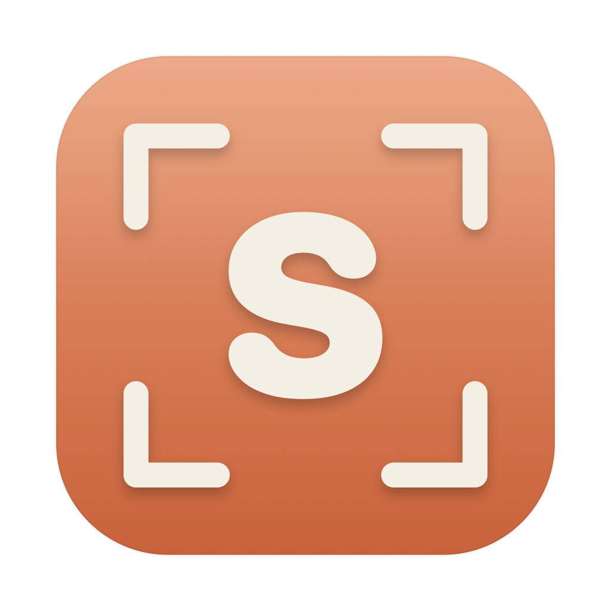

<p align="center">
  
</p>

<h1 align="center">SlopShot</h1>

<p align="center">
  A native macOS screenshot &amp; screen-recording tool, built from scratch in Swift.<br>
  UX inspired by <a href="https://cleanshot.com">CleanShot X</a> — original code, not a fork.
</p>

<p align="center">
  
  
  
</p>

> Menu-bar app (no Dock icon). Everything is driven from the menu-bar `S` icon and global hotkeys.

## Features

- **Capture** — full screen, drag-to-select region, **scrolling capture** (image stitching + Accessibility scroll-offset), and **text capture** (Vision OCR).
- **Screen recording** — record a region to `.mov`, with pause/resume, restart, and discard.
- **Annotation editor** — shapes, text, arrows; zoom via buttons, `⌘ +/-/0`, and trackpad pinch.
- **Floating preview card** — Copy / Save / Share / Pin, drag-out to other apps.
- **Video preview** — Quick Look (in-app player) + **Trim** tool with a custom filmstrip range slider, exporting *Trim Only* (`.mov`, passthrough) or *Trim & Convert* (MP4 / GIF).
- **Capture history**, **settings**, and configurable **global hotkeys**.

## Tech stack

Swift · SwiftUI · AppKit · ScreenCaptureKit · AVFoundation / AVKit · Vision (OCR) · CoreGraphics/CoreText · [XcodeGen](https://github.com/yonaskolb/XcodeGen)

## Build & run

Requires Xcode (macOS 15+ SDK) and XcodeGen (`brew install xcodegen`).

```bash
make run        # build Debug + launch
make install    # build Release → sign → copy to /Applications
```

### Code signing

The `Makefile` re-signs with a **stable self-signed identity** (`SlopShot Dev`) so that the
macOS Screen-Recording / Accessibility permissions stay granted across rebuilds.

To build it yourself, either:

- create a self-signed certificate named `SlopShot Dev` in **Keychain Access**
  (Certificate Assistant → *Create a Certificate…*, type *Code Signing*), **or**
- set `SIGN_ID=-` in the `Makefile` for ad-hoc signing (permissions reset on each rebuild).

The app is **not** sandboxed and is **not** notarized — it's intended for personal local use.
A locally-built app has no quarantine flag, so Gatekeeper lets it run without warnings.

## App icon

The logo (an `S` inside viewfinder crop-corners) is generated programmatically — no image files:

```bash
swift tools/make_icon.swift   # regenerates AppIcon + the menu-bar template
```

## License

Personal learning project. Provided as-is.
